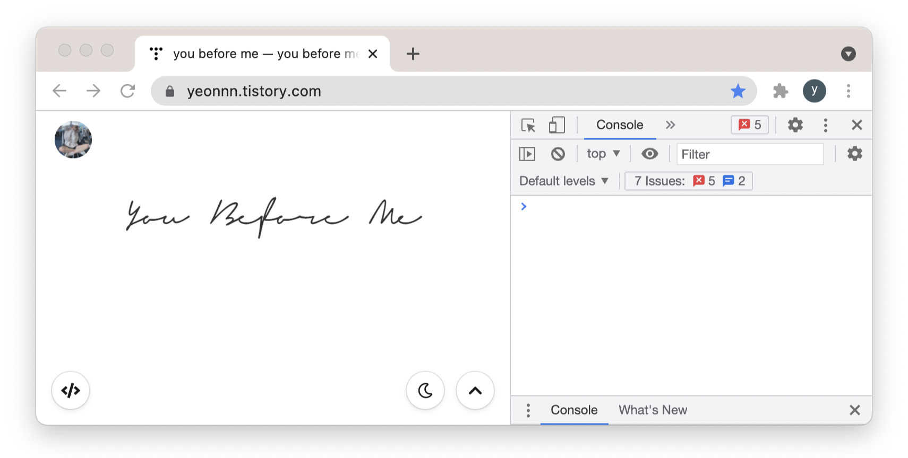
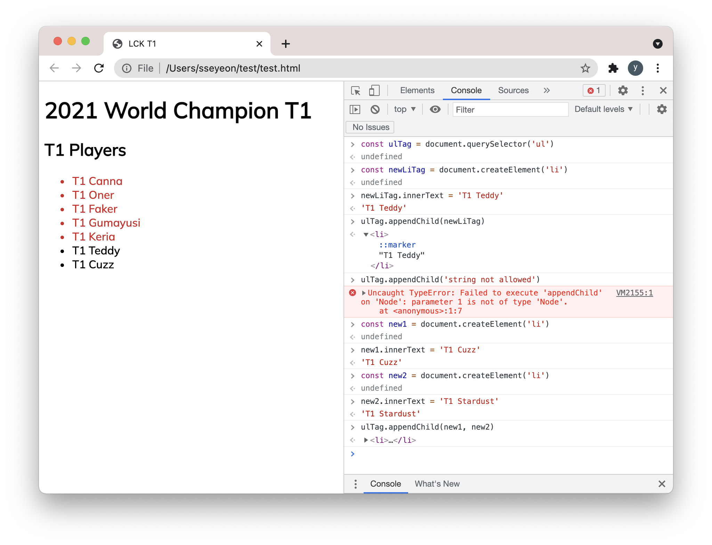
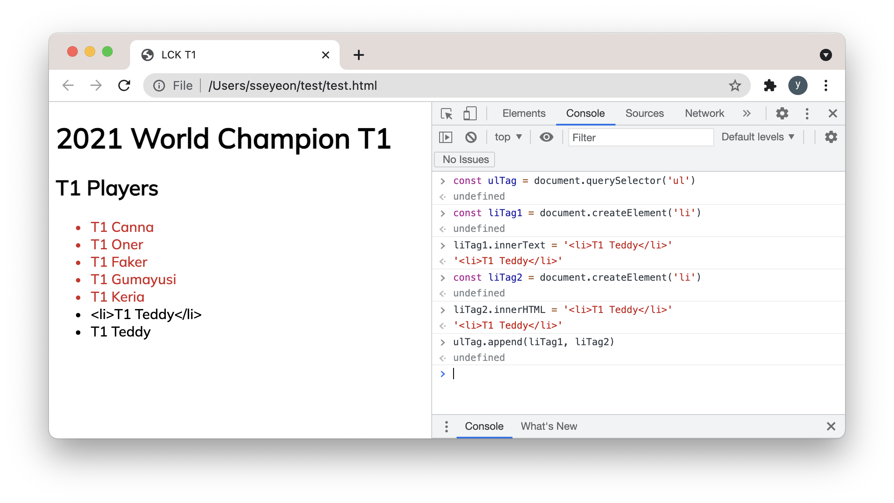

## ✂️ DOM 이란?

HTML, XML과 같은 문서를 다루기 위한 문서 프로그래밍 인터페이스로

문서를 구조화하고 구조화된 구성 요소를 하나의 객체로 취급하여 다루는 논리적 트리 모델이다.

문서가 구조화되어 있으며 각 요소는 객체(object)로 취급한다.

#### 주요 객체

- window: DOM을 표현하는 창으로 가장 최상위 객체 (작성시 생략 가능)
- document: 페이지 컨텐츠의 Entry Point의 역할을 하며등과 같은 수많은 다른 요소들을 포함
- navigator, location, history, screen

 

## ✂️ DOM 조작으로 Title 변경

1. command + alt + i 키를 통해 개발자 옵션으로 접속한다.

   

2. console 창에서 다음과 같은 명령어를 통해 title 이름을 바꿀 수 있다.

   

 

 

## ✂️ DOM 조작

선택(Select) → 변경(Manipulation) 의 순서로 조작한다.

 

### 📎 DOM 선택 관련 Method

- `document.querySelector(selector)`

  → 제공한 CSS selector를 만족하는 첫번째 element 객체를 반환한다.

- `document.querySelectorAll(selector)`

  → 제공한 선택자와 일치하는 여러 elements를 선택하며, 매칭할 하나 이상의 셀렉터를 포함하는 유효한 CSS selector를 인자(문자열)로 받고 지정된 셀렉터와 일치하는 NodeList를 반환한다.

  

이 두가지 method로 id, class, tag 선택자를 모두 사용할 수 있기 때문에 더 구체적이고 유연한 이용이 가능하다.
`document.querySelector('#id')`
`document.querySelector('.name')`

#### Collection

1. Live Collection
   문서가 바뀔 때 실시간으로 업데이트 되며 DOM의 변경사항을 실시간으로 collection에 반영한다.
   → HTMLCollection, NodeList
2. Static Collection (non-live)
   DOM이 변경되어도 collection 내용에는 영향을 주지 않는다.
   → `querySelectorAll()` 의 반환 NodeList만 static collection에 속한다

 

### 📎 DOM 변경 관련 Methods

#### Creation

`document.createElement()` → 작성한 태그명의 HTML 요소를 생성하여 반환

#### append DOM

- `Element.append()`

  특정 부모 Node의 자식 NodeList 중 마지막 자식 다음에 Node 객체나 DOMString을 삽입

  여러개의 Node 객체, DOMString을 추가할 수 있으며 반환 값이 없다

  

- `Node.appendChild()`

  한 Node를 특정 부모 Node의 자식 NodeList 중 마지막 자식으로 삽입

  오직 하나의 Node만 추가할 수 있으며 문자열은 추가할 수 없다

  

| ParentNode.append()               | Node.appendChild()                           |
| --------------------------------- | -------------------------------------------- |
| DOMString 객체 추가 가능          | Node 객체만 허용                             |
| 반환 값 없음                      | Node 객체 반환                               |
| 여러 Node 객체와 문자열 추가 가능 | 하나의 Node 객체만 추가 가능 (문자열 불가능) |

 

### 📎 DOM 변경 관련 속성 (property)

- `Node.innerText`
  - Node 객체와 그 자손의 텍스트 컨텐츠(DOMString)를 표현 (해당 요소 내부의 raw test) (사람이 읽을 수 있는 요소만)
  - 즉, 줄 바꿈을 인식하고 숨겨진 내용을 무시하는 등 최종적으로 스타일링이 적용된 모습으로 표현

- `Element.innerHTML`
  - 요소(element) 내에 포함된 HTML 마크업을 반환
  - XSS 공격에 취약하므로 사용 시 주의해야 한다

 

### 📎 DOM 삭제 관련 Methods

`ChildNode.remove()` → Node가 속한 트리에서 해당 Node를 제거

`Node.removeChild()` → DOM에서 자식 Node를 제거하고 제거된 Node를 반환

 

### 📎 DOM 속성 관련 Methods

- `Element.setAttribute(name, value)`
  - 지정된 요소의 값을 설정한다
  - 속성이 이미 존재하면 값을 갱신하고 존재하지 않으면 지정된 이름과 값으로 새 속성을 추가한다

- `Element.getAttribute(attributeName)`
  - 해당 요소의 지정된 값(문자열)을 반환한다
  - 인자(attributeName)는 값을 얻고자 하는 속성의 이름이다

